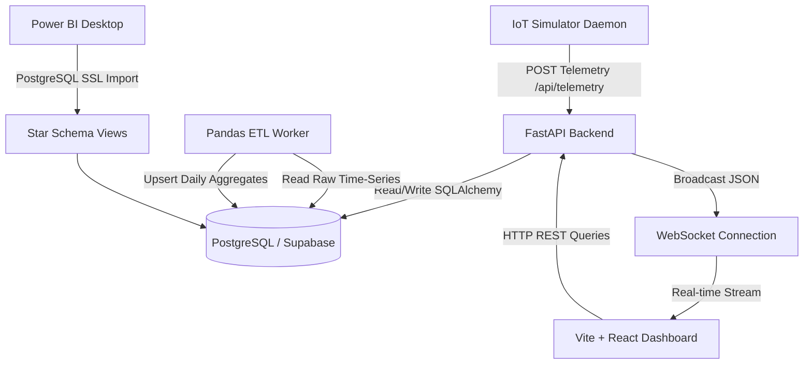
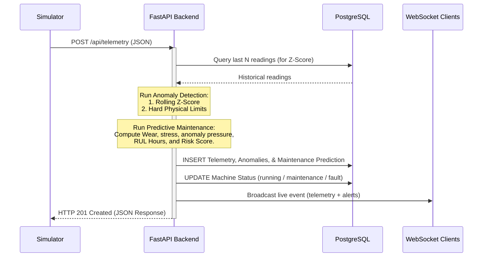

# 🏗️ Sentinel·SCADA — System Architecture

This document details the end-to-end architecture of Sentinel·SCADA, a real-time IoT machine monitoring and predictive maintenance platform.

---

## 1. System Component Hierarchy

Sentinel·SCADA is structured as a microservices application containerized via Docker Compose. The components interact as follows:



### Component Details
1. **IoT Simulator Daemon (`/simulator`)**: A Python application that models the physical state and sensor profiles of 10 machines. It injects random wear/stresses and periodic faults, POSTing telemetry readings to the API at a configurable frequency.
2. **FastAPI Backend (`/backend`)**: The core application engine. It handles ingestion, computes rolling statistics and predictive risk indices, writes incoming data to the database, and broadcasts live telemetry streams to the frontend over WebSockets.
3. **Database (`/db` or Cloud Supabase)**: PostgreSQL relational storage. Maintains tables for telemetry logs, registered machines, anomaly notifications, and maintenance schedules.
4. **ETL Worker (`/etl`)**: A scheduled Pandas worker that aggregates time-series logs into historical daily metrics.
5. **Vite + React Dashboard (`/frontend`)**: A client application displaying active machine statuses, live charts, operational KPIs, and scrolling critical alerts.
6. **Power BI (`/powerbi`)**: Business Intelligence layer consuming pre-built database views for enterprise analytics.

---

## 2. Database Schema Design (Star Schema)

The database schema is optimized for both high-throughput writes (raw IoT telemetry) and low-latency queries (Power BI reports & dashboard overview statistics).

```
                      ┌───────────────────────────┐
                      │    vw_dim_date (View)     │
                      │ ------------------------- │
                      │  date_key (PK)            │
                      │  year, quarter, month     │
                      │  day_name, is_weekend     │
                      └─────────────┬─────────────┘
                                    │ 1
                                    ▼ *
┌─────────────────────────┐ * ┌───────────────────────────┐ * ┌───────────────────────────┐
│  vw_dim_machine (View)  │──►│   vw_fact_daily (View)    │   │ vw_fact_latest_prediction │
│ ----------------------- │ 1 │ ------------------------- │   │ ------------------------- │
│  machine_id (PK)        │   │  machine_id (FK)          │   │  machine_id (FK)          │
│  code, name, type       │   │  date_key (FK)            │   │  ts, risk_score           │
│  location, install_date │   │  avg_temperature, energy  │   │  rul_hours, health_index  │
│  rated_power_kw, status │   │  anomaly_count, uptime    │   │  drivers                  │
└───────────┬─────────────┘   └───────────────────────────┘   └───────────────────────────┘
            │ 1
            │
            │ 1
            ▼ *
┌─────────────────────────┐
│  vw_fact_anomaly (View) │
│ ----------------------- │
│  anomaly_id (PK)        │
│  machine_id (FK)        │
│  date_key (FK)          │
│  sensor, value, severity│
└─────────────────────────┘
```

### Database Tables:
* **`machines`**: Contains descriptive metadata for each asset (e.g. rated power, install date, location).
* **`telemetry_raw`**: High-frequency operational logs (temperature, vibration, pressure, energy usage, RPM, operating hours). Heavily indexed on `(machine_id, ts DESC)`.
* **`anomalies`**: Stores statistical or physical boundary violations flagged during ingestion.
* **`maintenance_predictions`**: Holds risk rating, remaining useful life hours, recommended service date, and contributing root cause factors.
* **`machine_daily_aggregates`**: Aggregated table populated by the ETL worker to prevent Power BI from querying millions of raw rows.

---

## 3. Real-Time Ingestion & Analytics Pipeline

When the simulator sends a telemetry packet to `POST /api/telemetry`, the backend performs the following processing pipeline within a single transactional lifecycle:



---

## 4. Analytics Algorithms & Equations

To avoid heavy runtime overhead, the analytics system uses explainable statistical models that do not require offline training pipelines.

### A. Anomaly Detection (Rolling Z-Score & Hard Limits)
For each sensor reading $x_t$, the system queries the previous $N$ readings ($N = 50$, default) and computes the rolling mean $\mu$ and standard deviation $\sigma$. The Z-score is calculated as:

$$z = \frac{x_t - \mu}{\sigma}$$

* **Warning Anomaly**: Tripped if $|z| \ge 3.0$
* **Critical Anomaly**: Tripped if $|z| \ge 4.5$
* **Physical Guardrails**: Irrespective of $z$, a critical anomaly is generated if $x_t$ breaches hard safety boundaries:
  - $\text{Temperature} \notin [5.0, 95.0] \text{ }^\circ\text{C}$
  - $\text{Vibration} \notin [0.0, 11.0] \text{ mm/s RMS}$
  - $\text{Pressure} \notin [0.5, 12.0] \text{ bar}$
  - $\text{Energy Use} \notin [0.0, 1000.0] \text{ kWh}$

### B. Maintenance Risk Score (Blended Model)
The risk score ranges from $0$ to $100\%$ and is defined by three components:
1. **Usage Wear ($W$)**: Linear degradation against nominal asset design life ($D_{life}$):
   $$W = \min\left(\frac{\text{operating hours}}{D_{life}}, 1.0\right)$$
2. **Anomaly Pressure ($A_p$)**: Anomaly severity sum over the last 24 hours (Critical = 3 points, Warning = 1 point), saturated at 15 points:
   $$A_p = \min\left(\frac{\sum (\text{weighted anomalies})}{15}, 1.0\right)$$
3. **Instantaneous Stress ($S$)**: Peak headroom utilization of temperature and vibration:
   $$T_{stress} = \max\left(0, \frac{\text{temperature} - 60}{35}\right)$$
   $$V_{stress} = \max\left(0, \frac{\text{vibration} - 4.5}{6.5}\right)$$
   $$S = \min\left(\max(T_{stress}, V_{stress}), 1.0\right)$$

The final Risk Score ($R$) and Health Index ($H$) are:

$$R = 100 \times \min(0.45W + 0.35A_p + 0.20S, 1.0)$$

$$H = 100 - R$$

### C. Remaining Useful Life (RUL) Calculation
The baseline remaining hours are discounted using a condition-based multiplier:

$$\text{RUL} = \max\left(D_{life} - \text{operating hours}, 0\right) \times \left(1.0 - 0.5 \left(\frac{A_p + S}{2}\right) - 0.5S\right)$$

---

## 5. ETL Aggregation Logic
The ETL job aggregates data daily using Pandas:
* **Uptime Ratio**: Calculated as the percentage of clean readings (readings without critical alerts):
  $$\text{Uptime Ratio} = 1.0 - \frac{\text{Critical Anomaly Count}}{\text{Total Readings}}$$
* **Aggregation Storage**: Upserted back to the `machine_daily_aggregates` table on conflict. This maintains a small data volume for business intelligence software, enabling fast reporting intervals.
